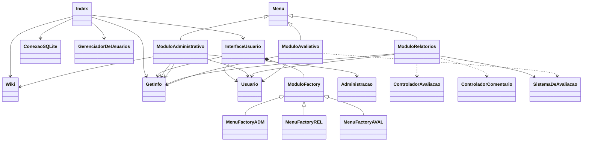

# Trabalho de PPOO - Sistema de Recomendação

Veja as Instruções do Trabalho no Campus Virtual da disciplina.

Preencha os campos abaixo de acordo com as intruções dadas.

## Definição do Grupo

**Nome do grupo**: PersonaOpina

**Tema escolhido**: Personagens de ficção (de filmes e jogos)

**Integrantes** (preencha abaixo):

- LEONARDO GONCALVES FLORA
- OSVALDO RODRIGUES DE FARIA JUNIOR
- ROBSON FERREIRA DOS SANTOS JUNIOR

## Checklist para a Primeira Entrega

**Preencha a coluna _Respostas_** na tabela abaixo **antes de fazer a primeira entrega**.

- Obs.: a coluna _Id_ indica a seção das Instruções do trabalho.

|  Id   |  Descrição                                                         | Respostas | 
|-------|--------------------------------------------------------------------|-----------|
| 2.1.1 | O sistema permite cadastrar itens?                                 | (sim) |
| 2.1.1 | O sistema usa o código fornecido para obter a descrição dos itens? | (sim) |
| 2.1.1 | Se sim na resposta anterior, de qual Wiki?                         | (sim) |
   R:     Wikipedia em português
| 2.1.2 | O sistema permite visualizar os detalhes dos itens?                | (sim) |
| 2.1.3 | O sistema permite excluir itens cadastrados?                       | (sim) |
| 2.1.4 | O sistema permite cadastrar usuários?                              | (sim) |
| 2.1.4 | Há tratamento para os diferentes tipos de usuários?                | (não) |
| 3.1.3 | O código implementado tem bom design de classes?                   | (sim) |
| 3.1.4 | O código implementado tem divisão de camadas?                      | (sim) |
| 3.1.5 | O código faz uso de herança? Tem superclasse e subclasses?         | (não) |
| 3.1.6 | O código inicial fornecido pelo professor foi alterado?            | (não) |
| 3.1.7 | Como os itens são salvos?                                          | (BIN) |
Arquivo Binario
| 3.1.8 | Diagrama simplificado em PNG se encontra na pasta `doc`?           | (não) |
| 3.1.9 | Código enviado compila sem erros na versão 17 do Java?             | (sim) |
| 3.1.9 | Implementação usa pacote `br.ufla.gac106.s2022_2.nomeDoGrupo`?     | (sim) |
| 3.1.9 | Foi adicionada alguma biblioteca (arquivo `.jar`)?                 | (não) |
| 3.1.9 | Código está legível, organizado e bem comentado?                   | (sim) |
| 3.1.9 | Todos os integrantes contribuíram, inclusive na implementação?     | (sim) |

## Checklist para a Entrega Final

**Preencha a coluna _Respostas_** na tabela abaixo **antes da entrega final**.

- Obs.: a coluna _Id_ indica a seção das Instruções do trabalho.

|  Id   |  Descrição                                                                  | Respostas | 
|-------|-----------------------------------------------------------------------------|-----------|
| 2.1   | Sistema trata todos os itens do módulo de Administração (primeira entrega)? | (sim) |
| 2.2.1 | É possível consultar a lista de itens cadastrados no módulo de Avaliação?   | (sim) |
| 2.2.1 | A lista pode ser ordenada por nome e por classificação média?               | (sim) |
| 2.2.2 | É possível filtrar os dados? Quais são os filtros?                          | (não) |
| 2.2.3 | O usuário consegue comentar os itens? Mais de uma vez?                      | (sim) |
| 2.2.3 | Os comentários são salvos (persistidos)?                                    | (sim) |
| 2.2.4 | O usuário consegue classificar os itens? Como?                              | (sim) |
   R:     Nota de 0 á 5
| 2.2.4 | As classificações são salvas (persistidas)?                                 | (sim) |
| 2.2.5 | No módulo de Avaliação, o usuário consegue ver os detalhes dos itens?       | (sim) |
| 2.2.5 | Os detalhes incluem classificação média e comentários?                      | (sim) |
| 2.2.6 | Foi implementado o módulo de relatórios?                                    | (sim) |
| 2.2.6 | Relatório permite consulta da quantidade de itens classificados ou não?     | (sim) |
| 2.2.6 | Relatório permite consulta dos 5 itens melhor classificados, de cada tipo?  | (sim) |
| 2.2.6 | Relatório permite consulta dos 3 usuários que mais classificaram itens?     | (sim) |
| 2.2.6 | Relatório permite consulta dos 3 usuários que mais comentaram itens?        | (sim) |
| 2.2.6 | Relatório permite exibição do gráfico usando código fonercido?              | (sim) |
| 3.1.3 | O código implementado tem bom design de classes?                            | (sim) |
| 3.1.4 | O código implementado tem divisão de camadas?                               | (sim) |
| 3.1.5 | O código faz uso de herança? Tem superclasse e subclasses?                  | (sim) |
| 3.1.6 | O código inicial fornecido pelo professor foi alterado?                     | (não) |
| 3.1.7 | Como os itens são salvos?                                                   | (BD)  |
| 3.1.8 | Diagrama simplificado em PNG se encontra na pasta `doc`?                    | (não) |
R: O Diagrama de classe simplificado em mermaid encontra-se nesse proprio arquivo README.md logo abaixo desta tabela(Diagrama está divido em três parte para facilitar a visualização)
| 3.1.9 | Código enviado compila sem erros na versão 17 do Java?                      | (sim) |
| 3.1.9 | Implementação usa pacote `br.ufla.gac106.s2022_2.nomeDoGrupo`?              | (sim) |
| 3.1.9 | Foi adicionada alguma biblioteca (arquivo `.jar`)?                          | (sim) |
   R:     sqlite-jdbc-3.20.0.jar na pasta lib
| 3.1.9 | Código está legível, organizado e bem comentado?                            | (sim) |
| 3.1.10| Código faz uso de variável polimórfica?                                     | (sim) |
| 3.1.10| Código faz uso de polimorfismo de método?                                   | (sim) |
| 3.1.11| Há tratamento de exceção para entradas inválidas do usuário?                | (sim) |
| 3.1.11| Há tratamento de exceção para programa não fechar por erro de execução?     | (sim) |
| 3.1.11| Há tratamento de exceção para exceções lançadas pela classe Wiki?           | (sim) |
| 3.1.12| Foi implementado algum Padrão de Projeto? Qual?                             | (sim) |
   R:    Foi implementado Abstract Factory na crição de modulos na interface de usuario
| 3.1.13| A interface de usuário é de fácil utilização?                               | (sim) |
| 3.1.13| Foi implementada interface gráfica de usuário?                              | (não) |
|       | Todos os integrantes contribuíram, inclusive na implementação?              | (sim) |

# Diagrama de Classes VIEWS

      
      
       
      
# Diagrama de Classes Regras de negócio

    
       
# Diagrama de Classes Acesso a dados

# Instruçoes de utilização
Na primeira execução do programa deve-se fazer o login com a credencial de administrador (login: adm, senha: adm).  
Administrador pode utilizar todas as funcionaliadades do programa.  
Modelador pode utilizar todas as funcionaliadades do programa exceto excluir itens.   
Avaliador pode utilizar somente os modulos de avaliação e relatório.  
   
Modulo de Administração:   
1 - Cadastrar personagem: Inseri novos itens.     
2 - Excluir personagem: Exclui itens.     
3 - Cadastrar Usuário: Cria um novo Cadastro de Usuario (Nivel de acesso igual ou menor que o usuario cadastrador).    
     
Modulo de Avaliação:     
1 - Listar todos os personagens: Exibe uma lista de todos os itens(Ordenação: ID, NOME,  MEDIA).     
2 - Listar dados de um personagem: Exibe detalhes de um item especifico.     
3 - Fazer um comentario: Comentar um item.  
4 - Listar comentarios: Exibe uma lista com todos comentários.  
5 - Fazer uma avaliacao: Avalia um item com uma nota de 0 á 5.  
6 - Listar avaliacoes: Exibe uma lista com todas as avaliações.    
   
Modulo de Ralatório:  
1 - Listar a quantidade de itens classificados/nao classificados  
2 - Listar os personagems com melhor avaliacao  
3 - Listar os usuarios que mais votaram   
4 - Listar os usuarios que mais comentaram   
5 - Grafico de avalicao de itens   

Em todos os modulos contém uma opção voltar para navegar entre os modulos.